---

# **Web RAG Copilot**

## 📋 Overview

**Web RAG Copilot** is a production-ready Generative AI application designed for secure, scalable enterprise environments. It features a Multi-Agent LLM architecture (powered by **Llama 3** via Groq) capable of real-time **web retrieval** through the Tavily Search API.

The system is engineered with a robust **MLOps/LLMOps pipeline**, performing continuous integration, code quality checks (SonarQube), automated Docker builds, and serverless deployment on **AWS Fargate**.

---

## 🏗 Architecture

The application uses a GitOps workflow integrating Jenkins, Docker, and AWS.

### Architecture Flow

```mermaid
graph LR

    %% External Services
    subgraph External_APIs [External AI Services]
        direction TB
        Groq[☁️ Groq API<br/>Llama 3 Inference]
        Tavily[🔍 Tavily API<br/>Web Search]
    end

    %% Main Application
    subgraph Application [Docker Container - The App]
        direction TB
        Streamlit[🖥️ Streamlit UI<br/>Frontend]
        FastAPI[⚙️ FastAPI<br/>Backend API]
        LangGraph[🧠 LangGraph Multi-Agent Logic]
        
        Streamlit -->|HTTP/JSON| FastAPI
        FastAPI --> LangGraph
    end

    %% CI/CD Pipeline
    subgraph CI_CD [CI/CD Pipeline - Jenkins]
        GitHub[🐙 GitHub<br/>Source Code]
        SonarQube[🛡️ SonarQube<br/>Quality Gate]
        DockerBuild[🐳 Docker Build<br/>Build Image]
    end

    %% AWS Cloud
    subgraph AWS_Cloud [AWS Production Environment]
        ECR[📦 AWS ECR<br/>Container Registry]
        Fargate[🚀 AWS Fargate<br/>Serverless Compute]
    end

    %% Connections
    LangGraph <-->|API Call| Groq
    LangGraph <-->|API Call| Tavily

    GitHub -->|Trigger| SonarQube
    SonarQube -->|Pass| DockerBuild
    DockerBuild -->|Push| ECR
    ECR -->|Deploy| Fargate
```



---

## 🚀 Key Features

* **Web RAG Multi-Agent System:** Intelligent routing of queries to real-time web search using Tavily.
* **Fast LLM Inference:** Powered by Groq’s ultra-low-latency Llama 3 deployment.
* **Automated CI/CD Pipeline:** End-to-end integration using Jenkins, GitHub, and AWS.
* **Code Quality Enforcement:** SonarQube quality gates block low-quality deployments.
* **Scalable Infrastructure:** Serverless execution via AWS Fargate with automatic scaling.
* **Secure Credentials:** IAM roles and environment-based secrets (no hardcoded keys).

---

## 🛠️ Tech Stack

| Domain                  | Tools                                                    |
| :---------------------- | :------------------------------------------------------- |
| **LLM & AI**            | Python, LangChain, LangGraph, Groq API (Llama 3), Tavily |
| **Backend API**         | FastAPI, Pydantic, Uvicorn                               |
| **Frontend**            | Streamlit                                                |
| **Containerization**    | Docker, Docker Compose                                   |
| **CI/CD Orchestration** | Jenkins (Pipeline-as-Code)                               |
| **Cloud Provider**      | AWS (ECS Fargate, ECR, IAM, VPC)                         |
| **Code Quality**        | SonarQube, Flake8                                        |

---

## 💻 Local Development Setup

### Prerequisites

* Docker & Docker Compose installed
* Python 3.10+
* AWS CLI configured (optional for deployment testing)

---

### 1. Clone the Repository

```bash
git clone https://github.com/amir-khosravi/web-rag-copilot.git
cd web-rag-copilot
```

### 2. Configure Environment

Create a `.env` file in the root directory:

```bash
GROQ_API_KEY="your_groq_key"
TAVILY_API_KEY="your_tavily_key"
PROJECT_NAME="Web RAG Copilot"
BACKEND_HOST="http://localhost:8000"
```

### 3. Run Locally (Docker)

Use the included runner script to run both services:

```bash
python dev_runner.py
```

* **Frontend:** [http://localhost:8501](http://localhost:8501)
* **Backend API Docs:** [http://localhost:8000/docs](http://localhost:8000/docs)

---

## ⚙️ CI/CD Pipeline Configuration

The repository includes a `Jenkinsfile` defining the automated pipeline:

1. **SCM Checkout** – pulls latest code from GitHub
2. **SonarQube Analysis** – enforces quality gates
3. **Docker Build & Push** – builds and pushes image to AWS ECR
4. **Deploy Stage** – triggers an ECS Fargate service update

---

### Jenkins (Docker-in-Docker)

#### 1. Build the Custom Jenkins Image

```bash
cd custom_jenkins
docker build -t jenkins-dind .
```

#### 2. Run Jenkins

```bash
docker run -d -p 8080:8080 -p 50000:50000 \
  -v /var/run/docker.sock:/var/run/docker.sock \
  -v jenkins_home:/var/jenkins_home \
  jenkins-dind
```

#### 3. Add Jenkins Credentials

* `aws-token`
* `github-token`
* `sonarqube-token`

---

## ☁️ AWS Deployment Details

The application is deployed on **AWS Fargate** as a fully serverless container.

* **Cluster:** `production-cluster`
* **Service:** `web-rag-copilot-service`
* **Networking:** Public subnets + Security Groups (port 8501 exposed)

### Manual Deployment

```bash
aws ecs update-service \
  --cluster production-cluster \
  --service web-rag-copilot-service \
  --force-new-deployment
```

---

## 📝 License

This project is licensed under the MIT License.
