````markdown
# Enterprise RAG Copilot


## 📋 Overview
**Enterprise RAG Copilot** is a production-ready Generative AI application designed for secure, scalable enterprise environments. It features a Multi-Agent LLM architecture (powered by **Llama 3** via Groq) capable of orchestrating external web search (Tavily) and internal knowledge base retrieval (RAG).

The project highlights a robust **MLOps/LLMOps** pipeline that automates the lifecycle from code commit to serverless deployment on **AWS Fargate**, ensuring high code quality via **SonarQube** gates.

## 🏗 Architecture
The system implements a GitOps workflow integrating Jenkins, Docker, and AWS.


### Architecture Flow

```mermaid
%%{init: {'theme': 'base', 'themeVariables': { 'primaryColor': '#007ACC', 'edgeLabelBackground':'#ffffff', 'tertiaryColor': '#E6F7FF'}}}%%
graph LR
    subgraph External_APIs ["External AI Services"]
        direction TB
        Groq[("☁️ Groq API\n(Llama 3 Inference)")]
        Tavily[("🔍 Tavily API\n(Web Search)")]
    end

    subgraph Application ["Docker Container (The App)"]
        direction TB
        Streamlit[("🖥️ Streamlit UI\n(Frontend)")]
        FastAPI[("⚙️ FastAPI\n(Backend API)")]
        LangGraph[("🧠 LangGraph Agent\n(Orchestration Logic)")]
        
        Streamlit -->|HTTP/JSON| FastAPI
        FastAPI --> LangGraph
    end

    subgraph CI_CD ["CI/CD Pipeline (Jenkins)"]
        GitHub[("🐙 GitHub\n(Source Code)")]
        SonarQube[("🛡️ SonarQube\n(Quality Gate)")]
        DockerBuild["🐳 Docker Build\n(Build Image)"]
    end

    subgraph AWS_Cloud ["AWS Production Environment"]
        ECR[("📦 AWS ECR\n(Container Registry)")]
        Fargate[("🚀 AWS Fargate\n(Serverless Compute)")]
    end

    %% Data Flow Connections
    LangGraph <-->|API Call| Groq
    LangGraph <-->|API Call| Tavily

    %% Pipeline Flow Connections
    GitHub -->|Webhook Trigger| SonarQube
    SonarQube -->|Pass| DockerBuild
    DockerBuild -->|Push Image| ECR
    ECR -->|Pull & Deploy| Fargate

    %% Styling
    classDef plain fill:#fff,stroke:#333,stroke-width:2px,color:#000;
    classDef aws fill:#FF9900,stroke:#232F3E,stroke-width:2px,color:white;
    classDef ci fill:#205081,stroke:#000,stroke-width:2px,color:white;
    classDef api fill:#00A67E,stroke:#000,stroke-width:2px,color:white;

    class ECR,Fargate aws;
    class GitHub,SonarQube,DockerBuild ci;
    class Groq,Tavily api;
    class Streamlit,FastAPI,LangGraph plain;
```



### Core Components
* **AI Engine:** LangChain & LangGraph agents with Llama 3 (70B).
* **Frontend:** Streamlit interface for user interaction.
* **Backend:** FastAPI microservice handling agent orchestration.
* **Infrastructure:** AWS ECS Fargate (Serverless Compute) & ECR (Container Registry).
* **CI/CD:** Jenkins with Docker-in-Docker (DinD) agents.
* **Quality Assurance:** Automated SonarQube static analysis.

---

## 🚀 Key Features
* **Multi-Agent Orchestration:** Intelligently routes queries between Web Search and Internal RAG.
* **Automated CI/CD:** Zero-touch deployment pipeline triggered by GitHub webhooks.
* **Quality Gates:** Deployment automatically blocked if code quality fails SonarQube checks.
* **Scalable Infrastructure:** Deployed on AWS Fargate for auto-scaling capabilities.
* **Security:** IAM Role-based authentication (no hardcoded AWS keys in code).

---

## 🛠️ Tech Stack
| Domain | Tools |
| :--- | :--- |
| **LLM & AI** | Python, LangChain, LangGraph, Groq API (Llama 3), Tavily |
| **Backend API** | FastAPI, Pydantic, Uvicorn |
| **Frontend** | Streamlit |
| **Containerization** | Docker, Docker Compose |
| **CI/CD Orchestration** | Jenkins (Pipeline-as-Code) |
| **Cloud Provider** | AWS (ECS Fargate, ECR, IAM, VPC) |
| **Code Quality** | SonarQube, Flake8 |

---

## 💻 Local Development Setup

### Prerequisites
* Docker & Docker Compose installed.
* Python 3.10+
* AWS CLI configured (for deployment testing).

### 1. Clone the Repository
```bash
git clone [https://github.com/amir-khosravi/enterprise-rag-copilot.git](https://github.com/amir-khosravi/enterprise-rag-copilot.git)
cd enterprise-rag-copilot
````

### 2\. Configure Environment

Create a `.env` file in the root directory:

```bash
GROQ_API_KEY="your_groq_key"
TAVILY_API_KEY="your_tavily_key"
PROJECT_NAME="Enterprise RAG Copilot"
BACKEND_HOST="http://localhost:8000"
```

### 3\. Run Locally (Docker)

Use the included runner script to spin up both Frontend and Backend services:

```bash
python dev_runner.py
```

  * **Frontend:** http://localhost:8501
  * **Backend Docs:** http://localhost:8000/docs

-----

## ⚙️ CI/CD Pipeline Configuration

This repository includes a `Jenkinsfile` defining the following automated stages:

1.  **SCM Checkout:** Pulls latest code from GitHub.
2.  **Code Quality Analysis:** Scans code using SonarQube; fails build on critical bugs.
3.  **Build & Push:** Builds the Docker image and pushes to AWS ECR.
4.  **Deploy:** Updates the AWS ECS Fargate service with the new image.

### Setting up Jenkins (Docker-in-Docker)

To replicate the CI/CD environment locally:

1.  **Build Custom Jenkins Image:**

    ```bash
    cd custom_jenkins
    docker build -t jenkins-dind .
    ```

2.  **Run Jenkins Container:**

    ```bash
    docker run -d -p 8080:8080 -p 50000:50000 \
      -v /var/run/docker.sock:/var/run/docker.sock \
      -v jenkins_home:/var/jenkins_home \
      jenkins-dind
    ```

3.  **Configure Credentials:**
    Add the following credentials in the Jenkins Dashboard:

      * `aws-token` (AWS Access Key & Secret)
      * `github-token` (GitHub Personal Access Token)
      * `sonarqube-token` (SonarQube Auth Token)

-----

## ☁️ AWS Deployment Details

The application is deployed as a serverless container on **AWS Fargate**.

  * **Cluster:** `production-cluster`
  * **Service:** `rag-copilot-service`
  * **Networking:** VPC with public subnets and Security Groups allowing port 8501.

### Manual Deployment (Optional)

If CI/CD is bypassed, you can deploy manually via AWS CLI:

```bash
aws ecs update-service --cluster production-cluster --service rag-copilot-service --force-new-deployment
```

-----

## 📝 License

This project is licensed under the MIT License.

```

